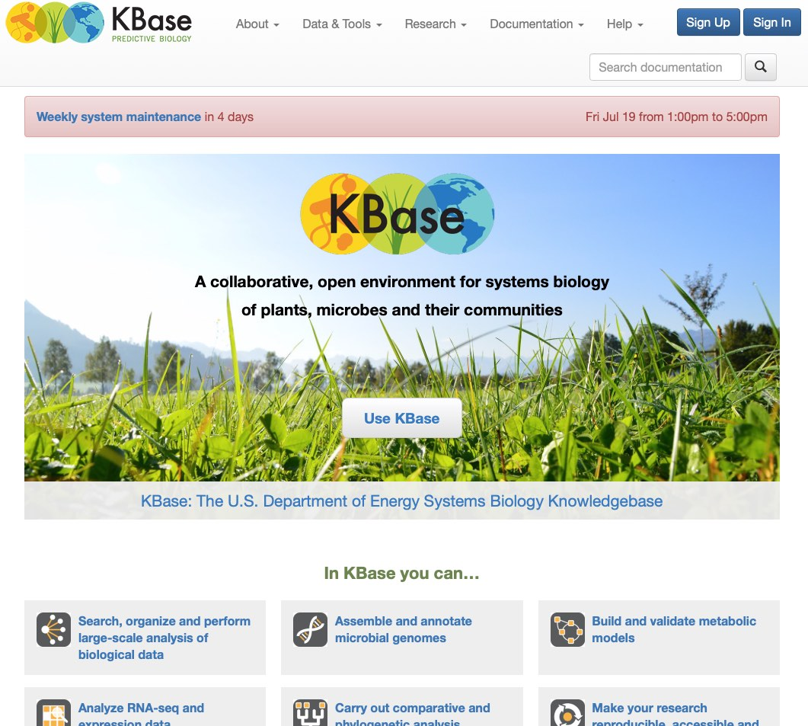
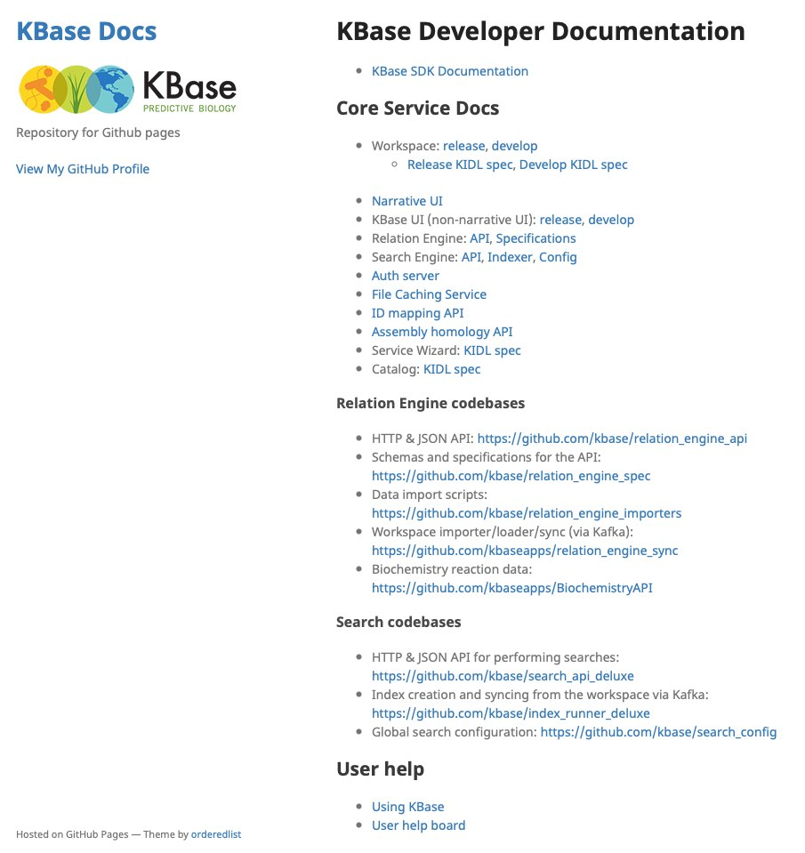

---
---

# KBase User Interfaces

KBase currently presents several distinct user interfaces. Although distinct from the internal point of view, it is not our intention to present them to the user as distinct experiences. Nonetheless, in practical terms they are created and developed separately.

Our goal is to integrate them as tightly as possible, both from the development and user experience.

They include:

- [KBase User Interfaces](#kbase-user-interfaces)
  - [Narrative Interface](#narrative-interface)
  - [KBase UI](#kbase-ui)
  - [Information and Documentation Site](#information-and-documentation-site)
  - [Documentation Collection](#documentation-collection)
  - [HTML Reports](#html-reports)

Although this page describes the array of user interfaces deployed at KBase, the remainder of the Overview section is concerned only with *KBase UI*.

## Narrative Interface

[https://narrative.kbase.us/narrative](https://narrative.kbase.us/narrative)

The *Narrative*, sometimes referred to as the *Narrative Interface*, is the primary interface to KBase Apps and Data. It is based on Jupyter (previously iPython) and inherits many of its characteristic of being a linear set of *cells*.

{:class="screenshot"}

## KBase UI

[https://narrative.kbase.us](https://narrative.kbase.us)

The *KBase UI* or *kbase-ui* is a partner web app for the *Narrative*. Originally intended to support login and object landing pages, it is now a general purpose platform for hosting small web apps which provide user tools for accessing different aspects of KBase.

Examples include the Dashboard, Catalog, Search, Account, User Profile, Organizations, and Feeds.

{:class="screenshot"}

## Information and Documentation Site

[https://kbase.us](https://kbase.us)

A third site hosts information about KBase as an organization, documentation, tutorials, and a blog. This site is hosted in Wordpress.

> Note: This site is currently under replacement, with an estimated release date of September 2019.

{:class="screenshot"}

## Documentation Collection

KBase developer documentation is maintained in Github Pages, hosted at kbase.github.io. Some documentation is created and formatted using Sphinx, other using Github Pages with a KBase theme.

Each active KBase repository contributes a separate documentation directory, with a top level table of contents gathering them all together for easier discovery.

{:class="screenshot"}

## HTML Reports

The Narrative Interface hosts a special type of web site or app called an *HTML Report*. These reports are produced by many apps as standalone "mini web sites" which contain a mix of output generated by 3rd party "wrapped" apps and content created by the app itself.

These reports are stored as zip archives in a KBase service named the "HTML File Set Service", and are served on demand with the narrative, with each report hosted in an iframe.

{:class="screenshot"}
